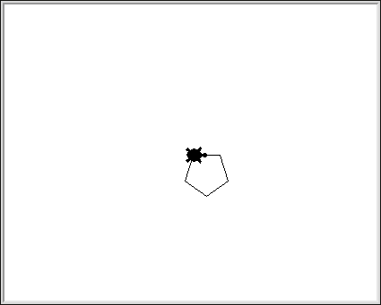
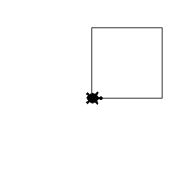
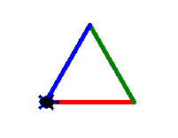
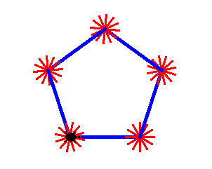

[meta title="Lesson 1: Introduction with Turtle" /]

[embed page="/learn/resources/highlight.js/embed" /]

To get started, we'll be using something called **`turtle`**.

**Turtle** is a python **[[../definitions/package|package]]** (A collection
of python code that provides a certain bit of functionality). It creates a
window with a **"cursor"** that allows us to draw lines and shapes on it, like
this pentagon example:

## Getting Started

Firstly, open up your [[../definitions/terminal|terminal]]...

* If you are on the **Lab Computers**, Hover your mouse over `Activities` on
  the top-left of the screen, and click on the black terminal icon on the left.
* If you are using **Windows**, press `Windows + R`, type in `cmd` and hit
  `Enter`. *Note: If you have not followed the instructions in [[../lesson_0]]
  to setup python properly, then the next bit will not work!*
* If you are using **Mac OS X**, open your Terminal app as you normally would.

Then start the python [[../definitions/interpreter|interpreter]] by typing in
`python` and pressing `Enter`. The python interpreter allows you to write code
line-by-line without having to save it anywhere (this is called
[[../definitions/interactive_mode|interactive mode]]).

You should see something like this:

    Python 2.7.5 (default, Sep  6 2013, 09:55:21)
    [GCC 4.8.1 20130725 (prerelease)] on linux2
    Type "help", "copyright", "credits" or "license" for more information.
    >>>

*Note: The numbers and all the details do not need to be the same, it just needs to
look vaguely similar.*

The interpreter is waiting for you to type in your first line of code.

We're going to tell python that we want to use the `turtle` package. Write this
text into the interpreter and hit `Enter` (which we will be doing with every
command we write).

**Note: Make sure you don't write the "`>>>`"**

    >>> import turtle

Now the package is ready for us to use, but a window has not yet appeared
because we have not told it to do anything. Let's tell it do do something!

    >>> turtle.forward(200)

A window should appear with an arrow that moved 200 pixels to the right.

We can also move the cursor backwards

    >>> turtle.backward(100)

And rotate it clockwise...

    >>> turtle.right(90)

...and anticlockwise

    >>> turtle.left(180)

*Note: The numbers that we tell it to rotate with are in degrees*
There are also these other commands you can try:

    # Imprint the image of the cursor on the drawing area
    >>> turtle.stamp()

    # Change the shape of the cursor, you have a choice of “arrow”, “turtle”, “circle”, “square”, “triangle” or “classic”
    >>> turtle.shape("turtle")

    # Change the thickness of the line you are drawing
    >>> turtle.width(5)

    # Stop drawing lines when you move
    >>> turtle.penup()

    # ...and resume drawing lines
    >>> turtle.pendown()

  
<strong>Task</strong>

  

  Have a play around with these commands, and try experimenting with the
  numbers.
  

## Your first Python file

There is of course a way of writing code which does require you to enter it
line-by-line in [[../definitions/interactive_mode|interactive mode]], we can
save a large amount of code in a single `.py` file and ask the
[[../definitions/interpreter|interpreter]] to run that instead.

*Note: This doesn't make [[../definitions/interpreter|interpreters]] useless,
it can be very handy when you just need to quickly test your ideas by writing
one or two lines of code*

Create a new folder in your [[../definitions/home_directory|home directory]]
called `python`, we will store all your files in here.

Open your [[../definitions/text_editor|text editor]] (Sublime Text):

* If you are using the **Lab Computers**, press `Alt + F2` and paste in this:
  `/usr/local/practicals/compsoc/sublime` and then hit `Enter`.
* If you are using your **own computer**, open sublime text how you normally
  would.

Save this new empty file as `001.py` in your new `python` folder.

  
<strong>Note</strong>

  

  <strong>Throughout this lesson (and indeed the course) there will be many
  code examples. Every time that we make a change to the code, you do not need
  to save it as the same file you were just working on, you can at any point
  save it with another name, so that you can keep the code from whatever you
  were doing last.
    
  It is up to you when you do this, it will not be suggested in these
  resources.</strong>
  

### Starting Code

Write the following code in your new file

    import turtle

    turtle.speed(3)
    turtle.shape("turtle")

    # Draw a Square

    # Bottom
    turtle.forward(100)
    turtle.left(90)

    # Right
    turtle.forward(100)
    turtle.left(90)

    # Top
    turtle.forward(100)
    turtle.left(90)

    # Left
    turtle.forward(100)
    turtle.left(90)

    # Prevent the program closing immediately
    raw_input()

You should take notice of three things:

#### Firstly:

We now have some lines of our code that start with a "`#`", these are called
[[../definitions/comments|comments]]. Python ignores comments, they are purely
there so that we can add extra information to our code to help us understand
it.

As far as python is concerned, these three bits of code:

    turtle.forward(100)

and

    # Comment above command
    turtle.forward(100)
and

    turtle.forward(100) # Comment on the same line as command

are all **identical**. You can read more about comments
[[../definitions/comments|here]].

#### Secondly:

There are lots of blank lines! Thankfully Python (along with most other
programming languages) allows you to add as many blank lines as you like to
space out your code, making it **much** clearer to read and understand.

#### Thirdly:

We have written some code `raw_input()` at the bottom that probably looks a bit
suspicious. We have done this so that the program doesnt close straight after
the turtle has finished drawing, what it does is it waits for you to hit
`Enter`, and will only close the program then. We will find out exactly how
this works in [[../lesson_2]].

  
<strong>Task</strong>

  

  You should try <strong>"commenting it out"</strong> (add a "<code>#</code>"
  at the start of the line to make it a comment), or deleting it, and then
  running your code to see what happens.
  

### Running your code

Open up your terminal, and instead of just typing in `python`, we are going to
tell python which `.py` file we want it to run. This will prevent it from going
into interactive mode, and it will just run your file.

Type in `python python/001.py` and hit `Enter`.

*Note: If you are having trouble running your code, you are probably in the
wrong `current working directory`, flag up one of the helpers.*

The turtle should move around the screen *anticlockwise*, and you should now
have an image that looks like this:

### A Splash of Colour

Let's modify the code a little bit, so that each side of the square is a
different colour. We will use `turtle.width` and `turtle.pencolor`.

**Note: You'll notice that the american spelling `color` and not `colour` is
used...** and you'll come accross this a lot with many programming languages
and packages for those languages.

Lets set the width to be a bit thicker, after `turtle.shape...` add this
command:

    turtle.width(5)

And before each `turtle.forward`, we will change the colour of the pen.

    import turtle

    turtle.speed(3)
    turtle.shape("turtle")
    turtle.width(5) # This is new...

    # Draw a Square

    # Bottom
    turtle.pencolor("red") # ... and so is this
    turtle.forward(100)
    turtle.left(90)

    # Right
    turtle.pencolor("green") # ... and this
    turtle.forward(100)
    turtle.left(90)

    # Top
    turtle.pencolor("blue") # ... and this
    turtle.forward(100)
    turtle.left(90)

    # Left
    turtle.pencolor("pink") # ... and also this!
    turtle.forward(100)
    turtle.left(90)

    # Prevent the program closing immediately
    raw_input()

After running your code again, you should see something a bit more like this:

### Who likes squares anyway...!?

Let's try making a triangle instead!

We only need 3 sides, so we can remove the code that draws the left one. And we
also need to change the angle that the turtle is turning from `90` degrees to
`120` degrees.

    import turtle

    turtle.speed(3)
    turtle.shape("turtle")
    turtle.width(5)

    # Draw a Triangle

    turtle.pencolor("red")
    turtle.forward(100)
    turtle.left(120)

    turtle.pencolor("green")
    turtle.forward(100)
    turtle.left(120)

    turtle.pencolor("blue")
    turtle.forward(100)
    turtle.left(120)

    # Prevent the program closing immediately
    raw_input()

Outcome:

## Introducing Variables

**Variables** are what we use to store information in the computer's memory for
the duration that the program is running for. Each variable has a name and a
starting value, and we can change these values within the program.

If we wanted a variable called `foo` to have a starting value `123` we would
write `foo = 123`.

For example, we can store the angle and length of the sides of our
shape in variables, and use them in our code like this:

    import turtle

    turtle.speed(3)
    turtle.shape("turtle")
    turtle.width(5)

    # Our Variables
    length = 100
    angle = 120

    turtle.pencolor("red")
    turtle.forward(length)
    turtle.left(angle)

    turtle.pencolor("green")
    turtle.forward(length)
    turtle.left(angle)

    turtle.pencolor("blue")
    turtle.forward(length)
    turtle.left(angle)

    # Prevent the program closing immediately
    raw_input()

If you run this code with the new variables, you should have the same triangle
as before!

  
<strong>Task</strong>

  

  Try playing around with the values of the variables and see what happens to
  the shape.
  

## Introducing Loops

You may notice that we have repeated quite a lot of code here, if we ignore the
colours for a second, this snippet...

    turtle.forward(length)
    turtle.left(angle)

... is repeated 3 times. This pattern of needing to repeat the same bit of code
over and over comes up quite a bit, and so in most programming languages, they
allow you to easily write loops.

There are a number of different types of loops, including `for` and `while`.
These will be covered in much more detail in the next lesson.

For example, expanding on our existing code, we want something to repeat the
two instructions mentioned above 3 times. *(We are going to ignore the colours
and line width for now)*

    import turtle

    turtle.speed(3)
    turtle.shape("turtle")

    # Our Variables
    length = 100
    angle = 120

    for count in range(3):
        turtle.forward(length)
        turtle.left(angle)

    # Prevent the program closing immediately
    raw_input()

Running this code, you should get another triangle, and the turtle should stop
in the same place it has been.

There are a few things to notice with this new code:

#### Firstly:

The line starting with `for` (the definition of the loop) has quite a lot of
things going on. For the time being, it is fine to not understand exactly what
each part means, it will be explained later on (in the second lesson).

You just need to know that the value `3` means that the loop repeats 3 times.

*If you really want, you can ask a helper to explain it to you now, but it will
become clearer and will be easier to explain later on.*

#### Secondly:

The two lines of code underneath the `for` definition are **"indented"** on the
left (they have been shifted right).

This is the method that python uses to group bits of code together. Here,
python needs to know which instructions in the code it should repeat with the
for loop.

*Aside: The way different languages handle this varies, you'll mostly find that
indentation is used (like here) or languages choose to surround the code with
curly braces (`{ }`) to group parts together.*

Lets see what happens when you only indent the turtle.forward() instruction,
like so:

  
<strong>Task</strong>

  

  Try and work out what it will do before you run the code, and check to see
  if you are right
  

    import turtle

    turtle.speed(3)
    turtle.shape("turtle")

    # Our Variables
    length = 100
    angle = 120

    for count in range(3):
        turtle.forward(length)
    turtle.left(angle)

    # Prevent the program closing immediately
    raw_input()

Is it what you expected?

### More Variables

Lets move the number of times we want to repeat the loop into a variable:

    import turtle

    turtle.speed(3)
    turtle.shape("turtle")

    # Our Variables
    sides = 3 # New Variable
    length = 100
    angle = 120

    for count in range(sides): # This line now uses a variable
        turtle.forward(length)
        turtle.left(angle)

    # Prevent the program closing immediately
    raw_input()

It should still be drawing the same triangle.

  
<strong>Task</strong>

  

  Adjust the variables to draw other regular polygons (pentagons, hexagons
  etc...)
    
  e.g: For a square, set <code>sides = 4</code> and <code>angle = 90</code>
  

## Introducing Mathematical Operations

You will probably have found that with the last task, you were working out
the angle manually, by dividing `360` by whatever you had set `sides` to.

Of course we could have the computer do this for us, we can write down
mathematical formulas using the operators "`+`" plus, "`-`" minus, "`*`" times
and "`/`" divide, and of course using brackets "`( )`". *Note: We can also use
variables in mathematical equations.*

Adjust angle's definition to: `angle = 360 / sides` like so:

    import turtle

    turtle.speed(3)
    turtle.shape("turtle")

    # Our Variables
    sides = 3
    length = 100
    angle = 360 / sides

    for count in range(sides):
        turtle.forward(length)
        turtle.left(angle)

    # Prevent the program closing immediately
    raw_input()

And run your code.

  
<strong>Task</strong>

  

  Try now to only change the value of sides and see if the shapes that you
  expect are drawn.
  

  
<strong>Final Task</strong>

  

  Now combine everything you have learned so far (<strong>loops</strong>,
  <strong>variables</strong>, <strong>maths</strong>) and all the turtle
  commands mentioned at the start to come up with some exotic creation.
    
  Some Ideas: a star, a robot, an animal, a building, a household object,
  some complex mathematical shape?
  

## An Advanced Example

Here is one last example using all of the techniques we have mentions, and even
contains some [[../definitions/nesting|nesting]]. Try and understand what this
code is doing, and why it results in the shape it does.

    import turtle

    turtle.speed(5)
    turtle.shape("turtle")

    # Variables for Big Shape
    big_sides = 5
    big_length = 100
    big_angle = 360 / big_sides
    big_width = 5
    big_color = "blue"

    # Variables for Spikes
    spikes_number = 12
    spikes_length = 20
    spikes_angle = 360 / spikes_number
    spikes_width = 3
    spikes_color = "red"

    for count in range(big_sides):

        turtle.width(big_width)
        turtle.pencolor(big_color)
        turtle.forward(big_length)

        # Add spikes on this vertex
        turtle.width(spikes_width)
        turtle.pencolor(spikes_color)
        for count in range(spikes_number):
            turtle.forward(spikes_length)
            turtle.backward(spikes_length)
            turtle.right(spikes_angle)

        turtle.left(big_angle)

    # Prevent the program closing immediately
    raw_input()

The Output:

